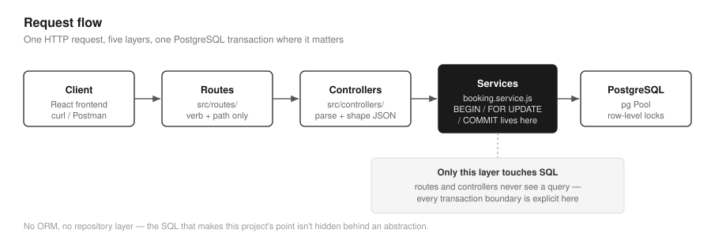
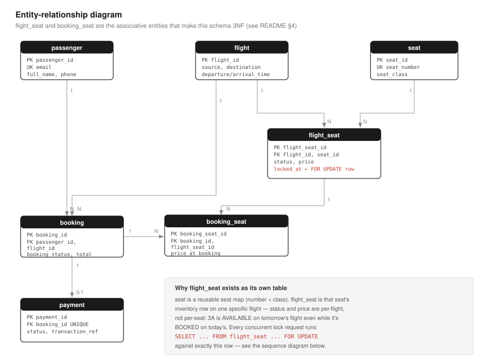
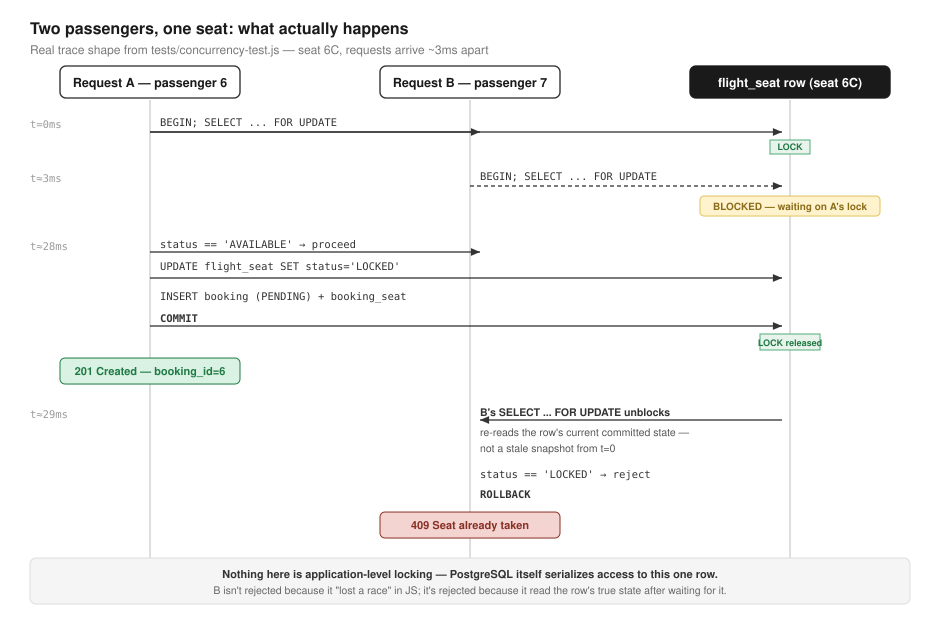

# Airline Reservation & Concurrent Seat-Locking System

A backend/DBMS-focused project: a REST API for searching flights, booking
seats, and paying for them, built to demonstrate **preventing two users
from booking the same seat at the same time** using PostgreSQL
transactions and row-level pessimistic locking (`SELECT ... FOR UPDATE`).

**Stack:** Node.js · Express.js · PostgreSQL (raw SQL via `pg`, no ORM)

No Redis, no queues, or microservices are used. The project focuses on a
clear design centered around database transactions and concurrency control.

A minimal React client lives in `frontend/` purely as a demo surface over
this API — it holds no business logic of its own (see `frontend/README.md`).
Everything in this document describes the backend, which contains the
core booking, transaction, and concurrency logic.

---

## 1. Why this project exists

Booking a seat is a classic concurrency problem: two users may read the
same row, both see the seat as available, and both attempt to update it.
Without proper synchronization, this can result in conflicting bookings.

This project's design focuses on solving that problem correctly using
PostgreSQL transactions and row-level locking while supporting the
complete booking lifecycle.

**What's implemented:**

- Flight search
- Seat availability per flight
- Temporary seat locking when a booking starts (`PENDING`)
- Booking confirmation with a simulated payment step
- Automatic rollback / seat release on payment failure or lock timeout
- Cancellation (releases the seat again)
- Booking history per passenger
- A reproducible concurrency test with simultaneous requests for the same
  seat
- SQL analytics queries for occupancy and revenue

**Out of scope:**

- Optimistic locking / version-column comparison
- Authentication/JWT
- Seat maps per aircraft type
- Multi-currency
- Real payment gateway integration
- Caching layer
- Message queues
- Horizontal scaling

These features are outside the current scope so the project can remain
focused on the core booking workflow and database concurrency handling.

---

## 2. Architecture



```text
Client (curl / Postman / test scripts)
        │  HTTP (JSON)
        ▼
Express routes  →  Controllers  →  Services  →  pg Pool  →  PostgreSQL
 (thin)             (thin)          (all business logic
                                      + transactions live here)
```

- **`routes/`** wire an HTTP verb and path to a controller function.
- **`controllers/`** parse the request, call a service, and shape the
  response. No SQL or transaction logic is placed here.
- **`services/booking.service.js`** contains the main booking logic.
  Every multi-statement operation is wrapped in a single PostgreSQL
  transaction via `withTransaction()` in `src/db/pool.js`.
- **`services/payment.service.js`** simulates an external payment gateway
  with random ~90% success by default, or a forced outcome for tests.
- **`services/lock-cleanup.service.js`** is a background job
  (`setInterval`, also callable through an endpoint) that releases seats
  whose lock has outlived `SEAT_LOCK_TIMEOUT_MINUTES` without being
  confirmed.

There is no separate repository layer. For a project of this size,
keeping SQL close to the service layer makes the database operations and
transaction flow easier to follow.

---

## 3. ER diagram



- `passenger (1) ──< booking (N)`
- `flight (1) ──< booking (N)`
- `flight (1) ──< flight_seat (N)`, `seat (1) ──< flight_seat (N)` —
  `flight_seat` is the associative entity that gives a physical `seat` an
  inventory row containing status and price for each flight.
- `booking (1) ──< booking_seat (N)`, `flight_seat (1) ──< booking_seat (N)`
  — `booking_seat` links a booking to the specific `flight_seat` rows it
  reserved.
- `booking (1) ── payment (0/1)` — one payment record per booking through
  a `UNIQUE` foreign key.

<details>
<summary>Mermaid source</summary>

```mermaid
erDiagram
    PASSENGER ||--o{ BOOKING : makes
    FLIGHT ||--o{ BOOKING : "is booked on"
    FLIGHT ||--o{ FLIGHT_SEAT : has
    SEAT ||--o{ FLIGHT_SEAT : "instance on"
    BOOKING ||--o{ BOOKING_SEAT : contains
    FLIGHT_SEAT ||--o{ BOOKING_SEAT : "reserved as"
    BOOKING ||--o| PAYMENT : "paid via"

    PASSENGER {
        int passenger_id PK
        varchar full_name
        varchar email UK
        varchar phone
    }

    FLIGHT {
        int flight_id PK
        varchar flight_number
        varchar source
        varchar destination
        timestamptz departure_time
        timestamptz arrival_time
        numeric base_price
    }

    SEAT {
        int seat_id PK
        varchar seat_number UK
        varchar seat_class
    }

    FLIGHT_SEAT {
        int flight_seat_id PK
        int flight_id FK
        int seat_id FK
        varchar status
        numeric price
        timestamptz locked_at
    }

    BOOKING {
        int booking_id PK
        int passenger_id FK
        int flight_id FK
        varchar booking_status
        numeric total_amount
    }

    BOOKING_SEAT {
        int booking_seat_id PK
        int booking_id FK
        int flight_seat_id FK
        numeric price_at_booking
    }

    PAYMENT {
        int payment_id PK
        int booking_id FK UK
        numeric amount
        varchar status
        varchar transaction_ref UK
    }
```

</details>

---

## 4. Schema decisions

- **`seat` is separate from `flight_seat`.** `seat` represents a reusable
  seat map containing the seat number and class. `flight_seat` represents
  the inventory of that seat for one specific flight, including its status
  and price.

  This allows the same seat layout to be reused across flights. A seat
  booked on one flight remains independent from the same seat on another
  flight.

- **`flight_seat.status` (`AVAILABLE` / `LOCKED` / `BOOKED`) is the
  primary source of truth for current seat availability.**

  It is also the row locked during booking attempts using `FOR UPDATE`.
  Keeping the mutable availability state on `flight_seat` allows each
  booking request to directly lock the specific seat inventory row.

- **`booking_seat.price_at_booking` stores a price snapshot.**

  If `flight_seat.price` changes later due to a fare update, historical
  bookings and revenue reports should continue to use the original price
  paid during booking.

- **A `flight_seat_id` can appear in multiple historical
  `booking_seat` rows.**

  A seat may be booked, cancelled, and booked again later by another
  passenger. Multiple historical booking records referencing the same
  `flight_seat_id` are therefore valid.

  The important rule is that only one active booking can hold a seat at
  a time. This is managed through the `flight_seat.status` state and
  row-level locking.

- **`CHECK` constraints provide database-level validation.**

  Examples include:

  - `source <> destination`
  - `arrival_time > departure_time`
  - Positive prices and payment amounts
  - Valid values for `flight_seat.status`
  - Valid values for `booking.booking_status`
  - Valid values for `payment.status`
  - Valid values for `seat.seat_class`

- **`payment` has a `UNIQUE` foreign key on `booking_id`.**

  Each booking has at most one payment record in the current design.

  A booking that fails payment moves to `FAILED` and its seat is released.
  A new booking can then be created for another payment attempt.

---

## 5. Booking / transaction flow

### 5.1 Lock a seat — `POST /api/bookings/lock`

The booking process begins by locking the requested seat rows.

```sql
BEGIN;

SELECT fs.flight_seat_id, fs.status, fs.price, s.seat_number
FROM flight_seat fs
JOIN seat s ON s.seat_id = fs.seat_id
WHERE fs.flight_id = $1
  AND s.seat_number = ANY($2::text[])
ORDER BY fs.flight_seat_id
FOR UPDATE OF fs;

-- application checks:
-- all requested seats exist?
-- all requested seats are AVAILABLE?

UPDATE flight_seat
SET status = 'LOCKED',
    locked_at = now()
WHERE flight_seat_id = ANY($1::int[]);

INSERT INTO booking (
    passenger_id,
    flight_id,
    booking_status,
    total_amount
)
VALUES ($1, $2, 'PENDING', $3)
RETURNING booking_id;

INSERT INTO booking_seat (
    booking_id,
    flight_seat_id,
    price_at_booking
)
VALUES (...);

COMMIT;
```

If any step fails, such as a requested seat being unavailable or a
database constraint being violated, the entire transaction is rolled
back through `withTransaction()` in `src/db/pool.js`.

This prevents partial updates, such as a seat being locked without a
corresponding booking.

### 5.2 Confirm a booking — `POST /api/bookings/:id/confirm`

```sql
BEGIN;

SELECT ...
FROM booking
WHERE booking_id = $1
FOR UPDATE;

SELECT ...
FROM flight_seat
...
FOR UPDATE OF fs;

-- call simulated payment gateway

INSERT INTO payment (...);

-- on SUCCESS:
-- flight_seat -> BOOKED
-- booking -> CONFIRMED

-- on FAILED:
-- flight_seat -> AVAILABLE
-- booking -> FAILED

COMMIT;
```

The payment result and booking updates are processed within the same
transaction.

On successful payment:

```text
flight_seat: LOCKED → BOOKED
booking:     PENDING → CONFIRMED
```

On payment failure:

```text
flight_seat: LOCKED → AVAILABLE
booking:     PENDING → FAILED
```

The payment record and the resulting booking and seat state changes are
committed together as part of the same transaction.

### 5.3 Cancel a booking — `POST /api/bookings/:id/cancel`

The cancellation process locks the booking row and its associated seats.

It then:

- Sets `flight_seat.status` to `AVAILABLE`
- Sets `booking.booking_status` to `CANCELLED`
- Marks a successful payment as `REFUNDED`

The refund process is simulated and does not connect to an external
payment provider.

### 5.4 Expired lock cleanup

A user may lock a seat and leave the booking process without confirming
or cancelling it.

Without cleanup, the seat could remain locked indefinitely.

`lock-cleanup.service.js` runs every 60 seconds using `setInterval`.
It can also be triggered through:

```text
POST /api/analytics/release-expired-locks
```

The cleanup process runs inside a transaction and:

1. Finds seats that remain `LOCKED` beyond
   `SEAT_LOCK_TIMEOUT_MINUTES`.
2. Releases those seats by setting their status to `AVAILABLE`.
3. Marks the associated `PENDING` booking as `FAILED`.

---

## 6. Concurrency control

### 6.1 Row-level locking



`SELECT ... FOR UPDATE` acquires an exclusive row-level lock on the
matched `flight_seat` row or rows for the duration of the transaction.

If another transaction attempts to execute `SELECT ... FOR UPDATE` on the
same row before the first transaction completes, PostgreSQL waits until
the first transaction commits or rolls back.

The database therefore serializes access to the contested seat row.

After the waiting transaction obtains the lock, it observes the latest
committed state of the row.

For example:

```text
Initial state:

Seat 3A → AVAILABLE
```

Two users request the same seat:

```text
User A ────┐
           ├── Request Seat 3A
User B ────┘
```

The first transaction locks the seat:

```text
User A → Seat 3A → LOCKED
```

When the second transaction continues, it observes:

```text
Seat 3A → LOCKED
```

Since the seat is no longer `AVAILABLE`, the request is rejected with:

```text
409 Seat Unavailable
```

### 6.2 Why a simple check-then-update is unsafe

Consider:

```sql
SELECT status
FROM flight_seat
WHERE flight_seat_id = 5;

-- sees AVAILABLE

UPDATE flight_seat
SET status = 'LOCKED'
WHERE flight_seat_id = 5;
```

Without row-level locking, two transactions can both read the seat status
as `AVAILABLE` before either transaction performs the update.

Both requests may then attempt to update the same seat.

This creates a race condition.

Using:

```sql
SELECT ... FOR UPDATE
```

ensures that the second transaction waits while another transaction is
currently working with the same seat row.

### 6.3 Stable lock ordering for multi-seat bookings

A booking may contain multiple seats.

For example:

```text
Passenger A: [1A, 1B]

Passenger B: [1B, 1A]
```

If transactions request locks in different orders, overlapping requests
can increase the risk of deadlocks.

To keep the locking order consistent, the query uses:

```sql
ORDER BY fs.flight_seat_id
```

This causes transactions to acquire seat locks in the same order based
on the `flight_seat_id`.

### 6.4 Isolation level

The application uses PostgreSQL's default:

```text
READ COMMITTED
```

isolation level.

The booking workflow relies on explicit row-level locking through:

```sql
SELECT ... FOR UPDATE
```

This ensures that concurrent transactions accessing the same seat do not
perform conflicting updates simultaneously.

### 6.5 Concurrency test

`tests/concurrency-test.js` creates multiple simultaneous booking
requests for the same seat using:

```javascript
Promise.all(...)
```

Example:

```bash
node tests/concurrency-test.js 1 6C 20
```

This creates 20 concurrent booking requests for seat `6C` on flight `1`.

Example result:

```text
Result | Passenger | HTTP | Latency | Detail
-------|-----------|------|---------|-------
LOST   | 7         | 409  |    68ms | Seat(s) already taken: 6C
WON    | 6         | 201  |    71ms | booking_id=1
LOST   | 20        | 409  |    72ms | Seat(s) already taken: 6C
...(17 more LOST)...

Succeeded: 1  Conflicted(409): 19  Other: 0
PASS: exactly one passenger successfully locked the seat.
```

The test was run with:

- 5 simultaneous requests
- 10 simultaneous requests
- 20 simultaneous requests

Each run resulted in one successful request while the remaining requests
were rejected because the seat was no longer available.

---

## 7. Testing

The following tests were run against a local PostgreSQL instance using a
freshly initialized schema.

- `tests/api-smoke-test.js` — full lifecycle:

  ```text
  search
  → seat availability
  → lock
  → duplicate lock rejected
  → confirm with forced payment SUCCESS
  → seat BOOKED
  → booking history
  → cancel
  → seat AVAILABLE again
  → lock
  → confirm with forced payment FAILURE
  → seat released
  → analytics endpoints
  ```

  **15/15 assertions pass.**

- `tests/concurrency-test.js` — executed with 5, 10, and 20 concurrent
  requests targeting the same seat. Each run resulted in exactly one
  successful request.

- Multi-seat concurrency testing — overlapping multi-seat requests were
  tested with the same seats requested in reversed order. The requests
  completed without a deadlock, with one request succeeding and the other
  being rejected based on seat availability.

- Database constraint testing:

  - Duplicate email rejected (`UNIQUE`)
  - `source = destination` rejected (`CHECK`)
  - Invalid `seat_class` rejected (`CHECK`)
  - Negative price rejected (`CHECK`)

- Lock-cleanup testing — a `LOCKED` seat's `locked_at` timestamp was
  manually set beyond the configured timeout. The cleanup process was
  triggered and the seat returned to `AVAILABLE` while its associated
  `PENDING` booking changed to `FAILED`.

- Analytics testing — all queries in
  `sql/04_analytics_queries.sql` were executed successfully against both
  an empty and a populated database.

- `frontend/` was tested end-to-end against the live API:

  ```text
  search
  → seat map
  → lock
  → confirm
  → cancel
  → history
  → concurrency test
  → analytics
  ```

### Issues identified during testing

Two implementation issues were found and fixed during testing.

#### 1. Transaction client usage

`confirmBooking` and `cancelBooking` initially read the updated booking
state through the shared connection pool:

```javascript
pool.query(...)
```

instead of the active transaction client:

```javascript
client.query(...)
```

Since the transaction had not yet committed, a query executed through a
different pooled connection could not see the uncommitted changes.

The issue was fixed by passing the active transaction client to the read:

```javascript
getBookingById(bookingId, client)
```

#### 2. Booking seat response shape

The API uses different seat response shapes in different endpoints.

`POST /api/bookings/lock` returns:

```javascript
seats: [
  {
    seat_number,
    price
  }
]
```

while confirm, cancel, and history endpoints read from
`v_booking_summary` and return:

```javascript
seat_numbers: ["3A", "3B"]
```

The frontend initially assumed the same response structure everywhere,
which caused the seat list to appear blank after confirmation.

The frontend was updated to handle the returned structure correctly.

`v_booking_summary` also does not join the `payment` table, so the current
booking summary does not include payment status.

---

## 8. Setup instructions

### Prerequisites

- Node.js 18+ (uses global `fetch` in the test scripts)
- PostgreSQL 14+ running locally or reachable with a user that can run
  `psql`

### Commands

```bash
# 1. Unzip and enter the project
unzip airline-reservation-system.zip
cd airline-reservation-system

# 2. Create the DB role + database
psql -U postgres -f sql/00_create_db.sql

# 3. Configure the app
cp .env.example .env

# Edit .env if your PostgreSQL configuration differs

# 4. Apply schema + views/triggers
export PGPASSWORD=airline_pass

psql -h localhost -U airline_user -d airline_db \
  -f sql/01_schema.sql

psql -h localhost -U airline_user -d airline_db \
  -f sql/02_constraints_indexes.sql

# 5. Install Node dependencies
npm install

# 6. Seed sample data
npm run seed

# 7. Start the API
npm start
```

The API starts at:

```text
http://localhost:3000
```

### Run the smoke test

In another terminal:

```bash
npm run test:api
```

### Run the concurrency test

```bash
node tests/concurrency-test.js 1 3A 10
```

Arguments:

```text
flightId seatNumber numberOfConcurrentUsers
```

To run the concurrency test again against the same seat:

```bash
./scripts/reset-db.sh
```

The reset script re-applies the schema and seed data.

### 8a. Optional: run the demo frontend

```bash
cd frontend
npm install
npm run dev
```

The frontend starts at:

```text
http://localhost:5173
```

The backend must already be running.

See:

```text
frontend/README.md
```

for frontend-specific details.

### Quick manual API tour

```bash
# Search flights
curl "http://localhost:3000/api/flights?source=BOM&destination=DEL"

# Get available seats
curl "http://localhost:3000/api/flights/1/seats"

# Lock a seat
curl -X POST localhost:3000/api/bookings/lock \
  -H "Content-Type: application/json" \
  -d '{"passengerId":1,"flightId":1,"seatNumbers":["3A"]}'

# Confirm booking
curl -X POST localhost:3000/api/bookings/1/confirm \
  -H "Content-Type: application/json" \
  -d '{"forcePaymentOutcome":"SUCCESS"}'

# Cancel booking
curl -X POST localhost:3000/api/bookings/1/cancel

# Passenger booking history
curl "http://localhost:3000/api/passengers/1/bookings"

# Occupancy analytics
curl "http://localhost:3000/api/analytics/occupancy"

# Revenue analytics
curl "http://localhost:3000/api/analytics/revenue"
```

---

## 9. Project structure

```text
airline-reservation-system/
├── docs/
│   └── diagrams/
│       ├── architecture.svg
│       ├── er-diagram.svg
│       └── concurrency-sequence.svg
│
├── frontend/
│   └── ...
│
├── scripts/
│   ├── seed.js
│   └── reset-db.sh
│
├── sql/
│   ├── 00_create_db.sql
│   ├── 01_schema.sql
│   ├── 02_constraints_indexes.sql
│   ├── 03_seed.sql
│   └── 04_analytics_queries.sql
│
├── src/
│   ├── config.js
│   ├── app.js
│   ├── server.js
│   │
│   ├── db/
│   │   └── pool.js
│   │
│   ├── routes/
│   │   ├── flights.routes.js
│   │   ├── bookings.routes.js
│   │   ├── passengers.routes.js
│   │   └── analytics.routes.js
│   │
│   ├── controllers/
│   │   ├── flights.controller.js
│   │   ├── bookings.controller.js
│   │   ├── passengers.controller.js
│   │   └── analytics.controller.js
│   │
│   ├── services/
│   │   ├── booking.se
