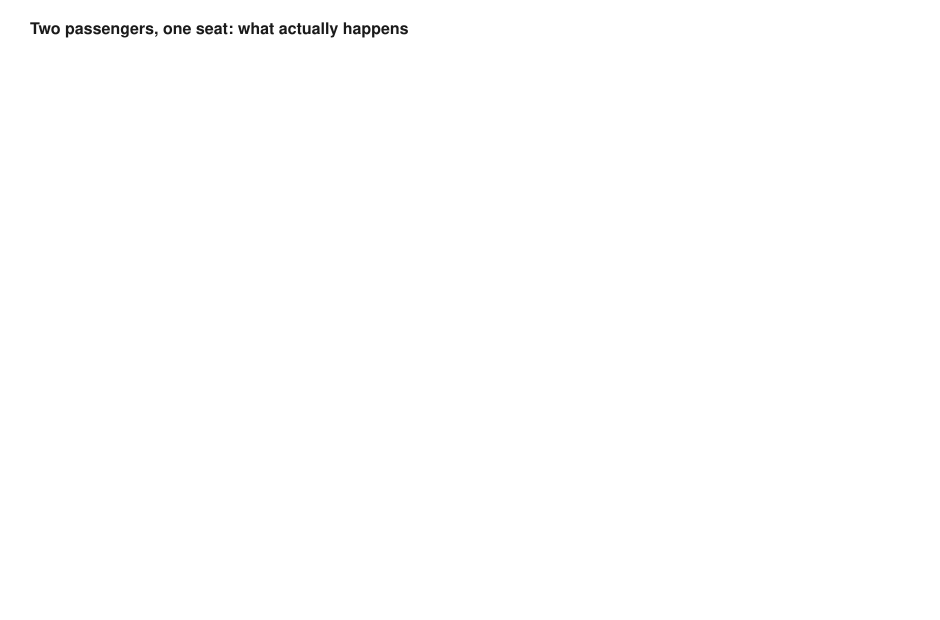

# Airline Reservation & Concurrent Seat-Locking System

A backend/DBMS-focused project: a REST API for searching flights, booking
seats, and paying for them, built to demonstrate **preventing two users
from booking the same seat at the same time** using PostgreSQL
transactions and row-level pessimistic locking (`SELECT ... FOR UPDATE`).

**Stack:** Node.js · Express.js · PostgreSQL (raw SQL via `pg`, no ORM)

No Redis, no queues, no microservices — on purpose. The whole point of
the project is to be interview-defensible: every line can be explained.

A minimal React client lives in [`frontend/`](frontend/README.md) purely
as a demo surface over this API — it holds no business logic of its own.
Everything in this document describes the backend, which is the actual
subject of the project.

### At a glance

| | |
|---|---|
| **Core guarantee** | Exactly one booking wins a contested seat, proven under real concurrent load |
| **Mechanism** | Row-level pessimistic locking (`SELECT ... FOR UPDATE`) inside explicit transactions |
| **Isolation level** | PostgreSQL default `READ COMMITTED` — correctness comes from the row lock, not snapshot isolation |
| **Tested** | `tests/api-smoke-test.js` (15/15 assertions) · `tests/concurrency-test.js` at 5/10/20 concurrent requesters, exactly 1 success every time |
| **Deliberately out of scope** | Auth/JWT, optimistic locking, real payment gateway, caching, horizontal scaling (see [§1](#1-why-this-project-exists)) |

---

## Contents

1. [Why this project exists](#1-why-this-project-exists)
2. [Architecture](#2-architecture)
3. [ER diagram](#3-er-diagram)
4. [Schema decisions](#4-schema-decisions-why-its-shaped-this-way)
5. [Booking / transaction flow](#5-booking--transaction-flow)
6. [Concurrency: how "exactly one succeeds" is guaranteed](#6-concurrency-how-exactly-one-booking-succeeds-is-actually-guaranteed)
7. [What was actually tested](#7-what-was-actually-tested-before-packaging)
8. [Setup instructions](#8-setup-instructions)
9. [Screenshots & demo](#9-screenshots--demo)
10. [Project structure](#10-project-structure)
11. [Interview questions this project should be able to answer](#11-interview-questions-this-project-should-be-able-to-answer)
12. [Environment variables](#12-environment-variables-env)

---

## 1. Why this project exists

Booking a seat is a classic "two users read the same row, both think it's
free, both write" race condition. This project's entire design revolves
around solving that one problem correctly and being able to prove it —
not around adding features.

**What's implemented:**
- Flight search
- Seat availability per flight
- Temporary seat locking when a booking starts (`PENDING`)
- Booking confirmation with a simulated payment step
- Automatic rollback / seat release on payment failure or lock timeout
- Cancellation (releases the seat again)
- Booking history per passenger
- A reproducible concurrency test: N simultaneous requests for the same
  seat, exactly 1 succeeds
- A handful of SQL analytics queries (occupancy, revenue)

**What's deliberately not implemented** (out of scope, listed so it's
clear this was a decision, not an oversight): optimistic locking /
version-column comparison, deadlock experiments, authentication/JWT,
seat maps per aircraft type, multi-currency, real payment gateway
integration, caching layer, horizontal scaling.

---

## 2. Architecture

```
Client (curl / Postman / test scripts / frontend/)
        │  HTTP (JSON)
        ▼
Express routes  →  Controllers  →  Services  →  pg Pool  →  PostgreSQL
 (thin)             (thin)          (all business logic
                                      + transactions live here)
```

- **`routes/`** just wire an HTTP verb + path to a controller function.
- **`controllers/`** parse the request, call a service, shape the response.
  No SQL, no transaction logic here.
- **`services/booking.service.js`** is where everything that matters
  happens: every multi-statement operation is wrapped in a single
  PostgreSQL transaction via `withTransaction()` in `src/db/pool.js`.
- **`services/payment.service.js`** simulates an external payment gateway
  (random ~90% success by default, or a forced outcome for tests/demos).
- **`services/lock-cleanup.service.js`** is a background job (`setInterval`,
  also callable via an endpoint) that releases seats whose lock has
  outlived `SEAT_LOCK_TIMEOUT_MINUTES` without being confirmed.

There is no separate "repository" layer — for a project this size, an
extra abstraction over `pg` would hide the SQL that is the whole point of
the project, not add value.


---

## 3. ER diagram

```
passenger ───┐
             │ 1
             │
             │ N
          booking ─────────────┐
             │ 1                │ 1
             │                  │
             │ N                │ 1
       booking_seat        payment
             │ N
             │
             │ 1
        flight_seat ───────── seat
             │ N                (seat_number, seat_class)
             │
             │ 1
          flight
```

- `passenger (1) ──< booking (N)`
- `flight (1) ──< booking (N)`
- `flight (1) ──< flight_seat (N)`, `seat (1) ──< flight_seat (N)` —
  `flight_seat` is the associative entity that gives a physical `seat` an
  inventory row (status, price) *per flight*.
- `booking (1) ──< booking_seat (N)`, `flight_seat (1) ──< booking_seat (N)`
  — `booking_seat` is the associative entity linking a booking to the
  specific `flight_seat` row(s) it reserved.
- `booking (1) ── payment (0/1)` — one payment attempt record per booking
  (a `UNIQUE` FK).

Mermaid version (renders on GitHub):

```mermaid
erDiagram
    PASSENGER ||--o{ BOOKING : makes
    FLIGHT ||--o{ BOOKING : "is booked on"
    FLIGHT ||--o{ FLIGHT_SEAT : has
    SEAT ||--o{ FLIGHT_SEAT : "instance on"
    BOOKING ||--o{ BOOKING_SEAT : contains
    FLIGHT_SEAT ||--o{ BOOKING_SEAT : "reserved as"
    BOOKING ||--o| PAYMENT : "paid via"

    PASSENGER {
        int passenger_id PK
        varchar full_name
        varchar email UK
        varchar phone
    }
    FLIGHT {
        int flight_id PK
        varchar flight_number
        varchar source
        varchar destination
        timestamptz departure_time
        timestamptz arrival_time
        numeric base_price
    }
    SEAT {
        int seat_id PK
        varchar seat_number UK
        varchar seat_class
    }
    FLIGHT_SEAT {
        int flight_seat_id PK
        int flight_id FK
        int seat_id FK
        varchar status
        numeric price
        timestamptz locked_at
    }
    BOOKING {
        int booking_id PK
        int passenger_id FK
        int flight_id FK
        varchar booking_status
        numeric total_amount
    }
    BOOKING_SEAT {
        int booking_seat_id PK
        int booking_id FK
        int flight_seat_id FK
        numeric price_at_booking
    }
    PAYMENT {
        int payment_id PK
        int booking_id FK UK
        numeric amount
        varchar status
        varchar transaction_ref UK
    }
```


---

## 4. Schema decisions (why it's shaped this way)

- **`seat` is separate from `flight_seat`.** `seat` is a reusable seat
  map (seat number + class). `flight_seat` is the inventory row for that
  seat *on one specific flight* — status and price are flight-specific
  (business class costs more, and a seat that's booked on Monday's
  flight is still available on Tuesday's). This is the normalization
  decision that makes the whole schema 3NF: seat class doesn't repeat
  per flight, price doesn't get stored redundantly on `seat`.

- **`flight_seat.status` (`AVAILABLE` / `LOCKED` / `BOOKED`) is the
  single source of truth for "is this seat takeable right now."** It is
  also the row every booking attempt locks with `FOR UPDATE`. Putting
  the mutable, contended state on its own narrow row (rather than, say,
  deriving availability by scanning `booking_seat`) is what makes
  `SELECT ... FOR UPDATE` cheap and precise — one row per seat per
  flight, locked directly.

- **`booking_seat.price_at_booking` snapshots the price.** If
  `flight_seat.price` changes later (a fare change), historical bookings
  and past revenue reports must not silently change. This is a standard
  "snapshot mutable reference data at transaction time" pattern.

- **No hard uniqueness constraint stopping a `flight_seat_id` from
  appearing in two `booking_seat` rows.** This is intentional, not a
  gap: a seat can legitimately be booked, cancelled, and booked again by
  someone else — that's two valid `booking_seat` rows referencing the
  same `flight_seat_id`, at different times, for different bookings. The
  invariant that actually matters — *at most one active claim on a seat
  at a time* — is enforced by the `flight_seat.status` state machine
  under a row lock, not by a static schema constraint. (This is a good
  interview question — see [§11](#11-interview-questions-this-project-should-be-able-to-answer).)

- **`CHECK` constraints do real validation at the DB level**, not just
  in application code: `source <> destination`, `arrival_time >
  departure_time`, positive prices/amounts, and enumerated status values
  for `flight_seat.status`, `booking.booking_status`, `payment.status`,
  `seat.seat_class`. Verified directly against the running DB (see
  [§7](#7-what-was-actually-tested-before-packaging)).

- **`payment` has a `UNIQUE` FK on `booking_id`.** One booking gets at
  most one payment attempt recorded per confirmation call (a booking
  that fails payment goes to `FAILED`, not back to `PENDING` for a
  retry, to keep the state machine simple — a new booking/lock is
  required to retry).

---

## 5. Booking / transaction flow

### 5.1 Lock a seat — `POST /api/bookings/lock`

This is the operation the whole project is built around.

```sql
BEGIN;

SELECT fs.flight_seat_id, fs.status, fs.price, s.seat_number
FROM flight_seat fs
JOIN seat s ON s.seat_id = fs.seat_id
WHERE fs.flight_id = $1 AND s.seat_number = ANY($2::text[])
ORDER BY fs.flight_seat_id     -- stable lock order, see §6.3
FOR UPDATE OF fs;              -- <-- row-level pessimistic lock

-- application checks: all requested seats exist? all AVAILABLE?
-- if not: throw -> outer code ROLLBACKs, locks released immediately

UPDATE flight_seat SET status = 'LOCKED', locked_at = now()
WHERE flight_seat_id = ANY($1::int[]);

INSERT INTO booking (passenger_id, flight_id, booking_status, total_amount)
VALUES ($1, $2, 'PENDING', $3) RETURNING booking_id;

INSERT INTO booking_seat (booking_id, flight_seat_id, price_at_booking)
VALUES (...);   -- one row per seat

COMMIT;
```

If any step fails (seat already taken, seat doesn't exist, a constraint
violation), the whole transaction is rolled back via `withTransaction()`
in `src/db/pool.js` — no partial booking, no orphaned `LOCKED` seat.

### 5.2 Confirm a booking — `POST /api/bookings/:id/confirm`

```sql
BEGIN;
SELECT ... FROM booking WHERE booking_id = $1 FOR UPDATE;   -- must be PENDING
SELECT ... FROM flight_seat ... FOR UPDATE OF fs;           -- re-lock its seats
-- call simulated payment gateway
INSERT INTO payment (...);
-- on SUCCESS: flight_seat -> BOOKED, booking -> CONFIRMED
-- on FAILED : flight_seat -> AVAILABLE, booking -> FAILED
COMMIT;
```

The payment call happens *inside* the transaction, and the resulting
booking/seat state change commits in the **same** transaction as the
payment record. That is what guarantees the system can never end up
"charged but not booked" or "booked but not charged" — both halves
commit together or neither does.

### 5.3 Cancel a booking — `POST /api/bookings/:id/cancel`

Locks the booking row and its seats, sets `flight_seat.status =
'AVAILABLE'`, `booking.booking_status = 'CANCELLED'`, and marks any
`SUCCESS` payment as `REFUNDED` (simulated — no real refund flow).

### 5.4 Expired lock cleanup

A booking that's locked but never confirmed (user abandoned checkout)
would otherwise hold a seat hostage forever. `lock-cleanup.service.js`
runs every 60s (`startLockCleanupJob`, also triggerable via `POST
/api/analytics/release-expired-locks` for demos) and, in one
transaction, releases any `flight_seat` still `LOCKED` past
`SEAT_LOCK_TIMEOUT_MINUTES` and marks its still-`PENDING` booking as
`FAILED`.

---

## 6. Concurrency: how "exactly one booking succeeds" is actually guaranteed

### 6.1 The mechanism

`SELECT ... FOR UPDATE` acquires an exclusive row-level lock on the
matched `flight_seat` row(s) for the duration of the transaction. If a
second transaction runs the same `SELECT ... FOR UPDATE` against the
same row before the first commits, **PostgreSQL blocks the second
transaction's statement** until the first transaction ends (COMMIT or
ROLLBACK). This is not application-level locking (a mutex, a Redis
lock) — it is the database itself serializing access to that row.

When the second transaction is unblocked, it re-reads the row as it now
exists — which reflects whatever the first transaction just committed
(`status = 'LOCKED'`), not a stale snapshot from before it started
waiting. So the second transaction correctly sees the seat is no longer
`AVAILABLE` and rejects the booking with `409 Seat Unavailable`.

### 6.2 Why not just check-then-update without a lock?

```sql
SELECT status FROM flight_seat WHERE flight_seat_id = 5;   -- sees AVAILABLE
-- (another transaction interleaves here and books the seat)
UPDATE flight_seat SET status = 'LOCKED' WHERE flight_seat_id = 5;  -- succeeds anyway!
```

Without `FOR UPDATE`, both transactions can read `AVAILABLE`
simultaneously and both proceed to `UPDATE` — a classic lost-update /
double-booking race. `FOR UPDATE` closes exactly this window by making
the second reader *wait* instead of reading a stale value.

### 6.3 Avoiding deadlocks on multi-seat bookings

If passenger A books seats `[1A, 1B]` and passenger B concurrently books
`[1B, 1A]` (same two seats, opposite order), naive locking could deadlock:
A holds 1A and waits for 1B while B holds 1B and waits for 1A. The fix
used here is `ORDER BY fs.flight_seat_id` in the locking `SELECT` —
every transaction always acquires locks in the same global order (by
primary key), so this specific deadlock pattern can't occur. Verified
manually (see [§7](#7-what-was-actually-tested-before-packaging)) with
two transactions requesting the same two seats in reversed order — no
deadlock, one wins cleanly with the other rejected.

### 6.4 Isolation level

The app uses PostgreSQL's default `READ COMMITTED` isolation level.
`READ COMMITTED` is sufficient here specifically *because* the
correctness relies on explicit row locks (`FOR UPDATE`), not on
snapshot isolation — `FOR UPDATE` makes each transaction re-check the
row's latest committed state after the lock is granted, which is
exactly the guarantee needed. (A pure optimistic/`SERIALIZABLE`
approach would be a different, equally valid design — see
[§11](#11-interview-questions-this-project-should-be-able-to-answer)
for the trade-off discussion.)

### 6.5 Proof: the concurrency test

`tests/concurrency-test.js` spins up N passengers and fires N truly
simultaneous `POST /api/bookings/lock` requests at the same seat via
`Promise.all`. Run against a clean seed:

```
$ node tests/concurrency-test.js 1 6C 20

Result | Passenger | HTTP | Latency | Detail
-------|-----------|------|---------|-------
LOST   | 7         | 409  |    68ms | Seat(s) already taken: 6C
WON    | 6         | 201  |    71ms | booking_id=1
LOST   | 20        | 409  |    72ms | Seat(s) already taken: 6C
...(17 more LOST)...

Succeeded: 1  Conflicted(409): 19  Other: 0
PASS: exactly one passenger won the seat; all others were correctly rejected.
```

Tested at 5, 10, and 20 simultaneous requesters — result is always
exactly 1 success. **This is the artifact to show in an interview** —
or, live, the Concurrency test tab in `frontend/`.



---

## 7. What was actually tested before packaging

All of the following were run against a real local PostgreSQL 16
instance, from a freshly reset schema, not just reasoned about:

- `tests/api-smoke-test.js` — full lifecycle (search → seat availability
  → lock → double-lock rejected → confirm w/ forced payment SUCCESS →
  seat BOOKED → booking history → cancel → seat AVAILABLE again → lock →
  confirm w/ forced payment FAILURE → seat released → analytics
  endpoints respond). **15/15 assertions pass.**
- `tests/concurrency-test.js` — run at 5, 10, and 20 concurrent
  requesters against the same seat. Exactly 1 success every time.
- Manual deadlock check: two overlapping multi-seat bookings requesting
  the same two seats in reverse order, fired concurrently — no deadlock,
  resolved in single-digit milliseconds, one winner.
- Manual constraint checks against the live DB: duplicate email
  rejected (`UNIQUE`), `source = destination` rejected (`CHECK`),
  invalid `seat_class` rejected (`CHECK`), negative price rejected
  (`CHECK`).
- Lock-cleanup job: manually aged a `LOCKED` seat's `locked_at` past the
  timeout, called the cleanup endpoint, confirmed the seat returned to
  `AVAILABLE` and its `PENDING` booking flipped to `FAILED`.
- All four analytics queries in `sql/04_analytics_queries.sql` run
  without error against both an empty and a populated database.

A bug was actually caught and fixed during this process: `confirmBooking`
and `cancelBooking` were reading the post-update booking state back
through the shared connection pool (`pool.query`) instead of the open
transaction's own client (`client.query`) — since the transaction hadn't
committed yet, that read a different, uncommitted-invisible connection
and silently returned stale pre-update data. Fixed by threading the
transaction's `client` through to the read (`getBookingById(bookingId,
client)`).

---

## 8. Setup instructions

### Prerequisites
- Node.js 18+ (uses global `fetch` in the test scripts)
- PostgreSQL 14+ running locally (or reachable) with a superuser you can
  run `psql` as

### Commands (copy-paste, in order)

```bash
# 1. Unzip and enter the project
unzip airline-reservation-system.zip
cd airline-reservation-system

# 2. Create the DB role + database (run once, as a Postgres superuser)
psql -U postgres -f sql/00_create_db.sql

# 3. Configure the app
cp .env.example .env
# edit .env if your Postgres user/password/host differ from the defaults

# 4. Apply schema + views/triggers
export PGPASSWORD=airline_pass
psql -h localhost -U airline_user -d airline_db -f sql/01_schema.sql
psql -h localhost -U airline_user -d airline_db -f sql/02_constraints_indexes.sql

# 5. Install Node dependencies
npm install

# 6. Seed sample data (passengers, flights, seat map, inventory)
npm run seed

# 7. Start the API
npm start
# -> Airline reservation API listening on http://localhost:3000

# 8. In another terminal: run the end-to-end smoke test
npm run test:api

# 9. Run the concurrency test (the main demo)
#    args: flightId seatNumber numberOfConcurrentUsers
node tests/concurrency-test.js 1 3A 10

# To re-run the concurrency test against the same seat again, reset first:
./scripts/reset-db.sh
```

`scripts/reset-db.sh` re-applies the schema and seed in one shot — use
it between concurrency test runs so you're always racing for a seat that
starts `AVAILABLE`.

### 8a. Optional: run the demo frontend

```bash
cd frontend
npm install
npm run dev
# -> http://localhost:5173
```

Requires the backend from step 7 to already be running. Details in
[`frontend/README.md`](frontend/README.md) — the Concurrency test tab
fires real simultaneous requests at the live server, no simulation.

### Quick manual API tour

```bash
curl "http://localhost:3000/api/flights?source=BOM&destination=DEL"
curl "http://localhost:3000/api/flights/1/seats"
curl -X POST localhost:3000/api/bookings/lock -H "Content-Type: application/json" \
  -d '{"passengerId":1,"flightId":1,"seatNumbers":["3A"]}'
curl -X POST localhost:3000/api/bookings/1/confirm -H "Content-Type: application/json" \
  -d '{"forcePaymentOutcome":"SUCCESS"}'
curl -X POST localhost:3000/api/bookings/1/cancel
curl "http://localhost:3000/api/passengers/1/bookings"
curl "http://localhost:3000/api/analytics/occupancy"
curl "http://localhost:3000/api/analytics/revenue"
```

---

## 9. Screenshots & demo

### System architecture (request flow)
Every HTTP request flows through 5 layers: Client → Routes → Controllers → Services → PostgreSQL. The critical difference: **only the Services layer sees transactions and SQL locks.** Routes and controllers have zero awareness of concurrency or the database.


---

### Flight search and seat map

The frontend provides a minimal UI for the full booking lifecycle. Start by searching flights, then select seats on an interactive seat map.

| Search flights | Seat map view |
|---|---|
|  |  |

---

### Booking workflow

Select seats, lock them (which triggers `SELECT ... FOR UPDATE` on the backend), then confirm with a simulated payment.

| Seat selection | Booking confirmation |
|---|---|
|  |  |

---

### Booking history

Track all past bookings for a passenger, with the ability to cancel confirmed bookings.


---

### **The main demo: Concurrency test — exactly one winner**

This is the proof that the pessimistic locking works. Fire 10 real simultaneous HTTP requests at the same seat from 10 different passengers:

- **Expected:** 1 passes (201 Created), 9 fail (409 Conflict)
- **Result:** Always exactly 1 winner, every time, under load

The browser sends real `POST /api/bookings/lock` requests in parallel. The backend's `SELECT ... FOR UPDATE` ensures only the first to acquire the database-level row lock can proceed. The second and subsequent transactions wait for the lock, then re-read the now-`LOCKED` seat and reject with a 409.


---

### How two passengers race for one seat (under the hood)

This sequence diagram shows what actually happens when two passengers try to book the same seat milliseconds apart. Request A locks the row first, updates it, commits. Request B's `SELECT ... FOR UPDATE` then blocks, waiting for A's lock. When A commits, B unblocks, re-reads the now-`LOCKED` seat, and correctly rejects.


---

### Analytics dashboard

View occupancy rates per flight and confirmed revenue.


---

## 10. Project structure

```
airline-reservation-system/
├── sql/
│   ├── 00_create_db.sql           role + database creation
│   ├── 01_schema.sql              tables, PKs, FKs, CHECK/UNIQUE constraints
│   ├── 02_constraints_indexes.sql triggers + read views
│   ├── 03_seed.sql                sample passengers/flights/seats
│   └── 04_analytics_queries.sql   standalone occupancy/revenue queries
├── src/
│   ├── config.js
│   ├── app.js                     Express app + central error handler
│   ├── server.js                  entrypoint
│   ├── db/pool.js                 pg Pool + withTransaction() helper
│   ├── routes/                    thin route -> controller wiring
│   ├── controllers/                HTTP parsing/shaping only
│   ├── services/
│   │   ├── booking.service.js      ALL transaction/locking logic
│   │   ├── payment.service.js      simulated payment gateway
│   │   └── lock-cleanup.service.js expired-lock release job
│   └── utils/
├── tests/
│   ├── concurrency-test.js         THE demo: N users race for 1 seat
│   └── api-smoke-test.js           full lifecycle end-to-end test
├── scripts/
│   ├── seed.js
│   └── reset-db.sh
├── frontend/                      React/Vite demo client (see frontend/README.md)
├── assets/
│   └── screenshots/               diagrams and UI screenshots
├── .env.example
└── README.md
```

---

## 11. Interview questions this project should be able to answer

**Q: What actually prevents a double-booking?**
`SELECT ... FOR UPDATE` inside a transaction on the `flight_seat` row.
It's a row-level exclusive lock held until COMMIT/ROLLBACK; a second
transaction requesting the same row blocks until the first finishes,
then re-reads the current (not stale) status. See [§6.1](#61-the-mechanism).

**Q: Why pessimistic locking instead of optimistic locking (a version
column + compare-and-swap)?**
Both are valid for this problem. Pessimistic locking was chosen because
seat booking is a short, cheap transaction with potentially high
contention on popular seats (window/aisle on a full flight) — under
contention, optimistic locking means many clients read, fail the
version check, and have to retry, which wastes work and can starve
under pathological load. Pessimistic locking makes losers fail once,
immediately, with a clear reason, instead of retrying blindly. The
trade-off: pessimistic locking holds a lock for the transaction's
duration, so a slow client (or a slow payment gateway call) blocks
others longer — which is why the payment call in `confirmBooking` is
kept fast (simulated, no real network dependency) and why locks
auto-expire via the cleanup job if a client disappears mid-flow.

**Q: What if a user locks a seat and then never confirms or cancels?**
The seat stays `LOCKED`, unbookable by anyone else, until
`lock-cleanup.service.js` runs and releases anything past
`SEAT_LOCK_TIMEOUT_MINUTES`. See [§5.4](#54-expired-lock-cleanup).

**Q: How do you know the fix actually works, not just "should work in
theory"?**
`tests/concurrency-test.js` fires real concurrent HTTP requests (not a
single-threaded simulation) at the same seat and asserts exactly one
`201` and the rest `409`. Run at 5/10/20 concurrent requesters with
consistent results — see [§6.5](#65-proof-the-concurrency-test) and
[§7](#7-what-was-actually-tested-before-packaging).

**Q: Why is `flight_seat` a separate table from `seat`?**
Because status and price are per-flight, not per-seat-globally — seat
`3A` is available on tomorrow's flight even though it's booked on
today's, and business class seats cost more only because of a
multiplier applied when the flight_seat row is created. Splitting them
is what keeps the design in 3NF instead of duplicating seat metadata
per flight or storing a flight-varying fact on a flight-independent
table. See [§4](#4-schema-decisions-why-its-shaped-this-way).

**Q: Why doesn't `booking_seat` have a UNIQUE constraint on
`flight_seat_id`?**
Because a seat legitimately gets booked, then cancelled, then booked
again by someone else — those are two different, both-valid
`booking_seat` rows referencing the same `flight_seat_id` at different
times. The actual invariant — *no two simultaneously active bookings
on one seat* — is a runtime state-machine property (`flight_seat.status`
guarded by the row lock), not something a static uniqueness constraint
can express, because uniqueness constraints can't see "still active."
See [§4](#4-schema-decisions-why-its-shaped-this-way).

**Q: What happens if the payment step throws an exception (not just
returns FAILED)?**
`withTransaction()` catches any thrown error, issues `ROLLBACK`, and
re-throws to the HTTP layer as a 5xx. The whole transaction — including
the earlier `UPDATE flight_seat` from the lock step in a prior request —
is untouched because it was already committed in a separate,
already-closed transaction; the seat stays `LOCKED` and will be cleaned
up by the timeout job like any other abandoned confirmation attempt.

**Q: How would you scale this to handle a real airline's traffic?**
Out of scope for this project by design (see [§1](#1-why-this-project-exists)),
but the honest answer: read-heavy endpoints (search, seat availability)
scale horizontally trivially since they're plain reads; the write path
(seat locking) is bounded by row-lock contention on whatever seat is
currently "hot," which for a single seat is inherently serial no matter
what — the real lever is keeping the locked critical section (between
`FOR UPDATE` and `COMMIT`) as short as possible, which is why payment
happens in `confirmBooking`'s own separate transaction rather than
inside the initial lock.

**Q: What's the difference between `LOCKED` (the `flight_seat.status`
value) and the `FOR UPDATE` row lock?**
Two different things with similar names. `FOR UPDATE` is a *transient*
PostgreSQL row lock that exists only while a transaction is open and is
released automatically on COMMIT/ROLLBACK. `status = 'LOCKED'` is
*persisted application data* that outlives any single transaction —
it's what tells the next request "this seat is reserved, pending
payment" even after the locking transaction has already committed and
released its row lock.

**Q: Why raw SQL instead of an ORM?**
The `SELECT ... FOR UPDATE` + explicit transaction boundary is the point
of the project — an ORM's abstraction over both would hide exactly the
mechanism this project exists to demonstrate.

---

## 12. Environment variables (`.env`)

| Variable | Default | Meaning |
|---|---|---|
| `PORT` | `3000` | HTTP port for the API |
| `PGHOST` | `localhost` | PostgreSQL host |
| `PGPORT` | `5432` | PostgreSQL port |
| `PGUSER` | `airline_user` | PostgreSQL user |
| `PGPASSWORD` | `airline_pass` | PostgreSQL password |
| `PGDATABASE` | `airline_db` | PostgreSQL database name |
| `SEAT_LOCK_TIMEOUT_MINUTES` | `5` | How long a seat stays `LOCKED` before the cleanup job releases it |
